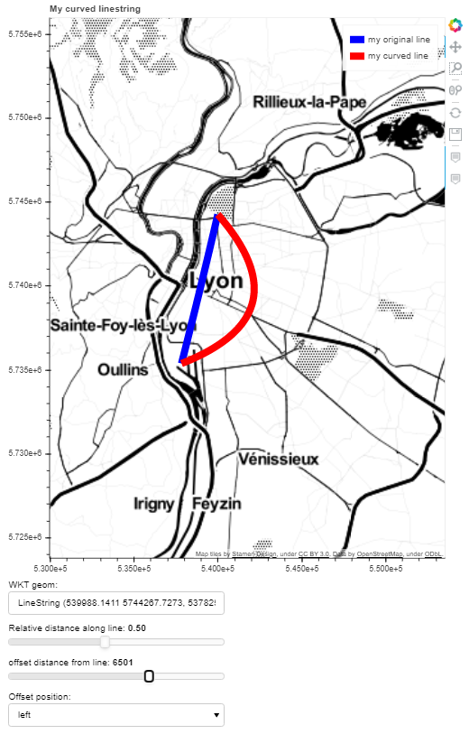

# linestring-bender


Because it's fun to bend a LineString :)

Based on this stackoverflow topic: https://stackoverflow.com/questions/12643079/b%C3%A9zier-curve-fitting-with-scipy


```
conda env create -f environment.yml

cd linestring-bender
bokeh serve main.py --show
```


